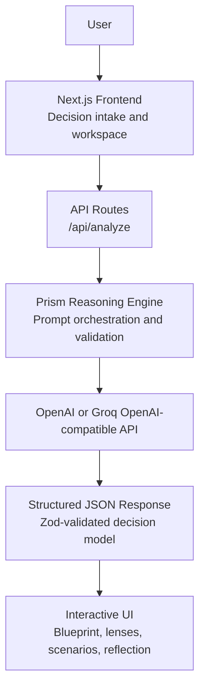
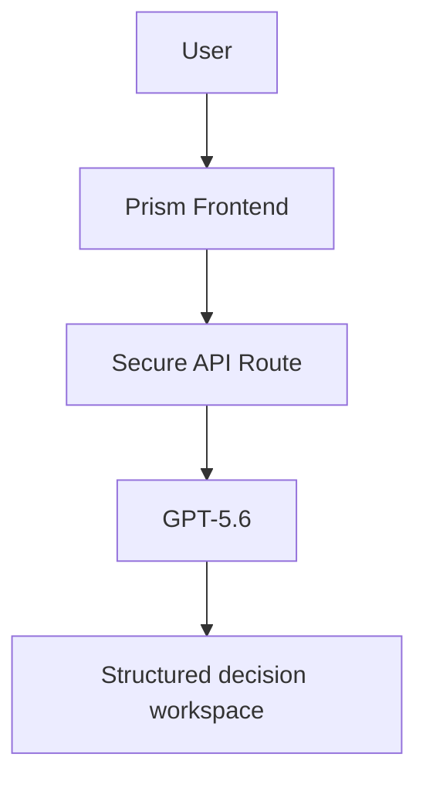

# Prism

> **Understand your decision before you make it.**

Prism is an AI-native decision workspace for exploring complex choices through structured reasoning. Rather than giving users a single answer, Prism reveals the goals, constraints, assumptions, risks, unknowns, and trade-offs their decision depends on.

Built for the OpenAI hackathon's **Work & Productivity** category.

## Project overview

Important decisions are rarely simple questions with one correct answer. They involve incomplete information, personal values, competing priorities, and assumptions that often go unnoticed.

Prism turns a decision into an explorable model. It helps users examine the structure behind a choice, apply relevant reasoning lenses, compare plausible scenarios, pressure-test fragile assumptions, and leave with concrete research actions and reflection prompts.

Prism does not decide for people. It helps them make their own judgment more rigorous.

## Problem statement

Most AI assistants optimize for a polished recommendation. That is not always useful for decisions involving uncertainty: a confident answer can hide the assumptions, trade-offs, and missing evidence that matter most.

People need a workspace that helps them think before they commit, not another chatbot that tells them what to do.

## Solution

Prism uses GPT-5.6 to produce a structured decision model instead of an unstructured chat response. The model is presented through an interactive workspace where users can inspect the reasoning, compare conditions, and identify what they should verify next.

The product uses transparent language throughout: outputs are framed as working hypotheses and plausible scenarios, never predictions or directives.

## Key features

- **Decision Blueprint** - maps goals, values, constraints, unknowns, risks, assumptions, stakeholders, resources, success criteria, and opportunities.
- **Dynamic Reasoning Lenses** - selects relevant perspectives for each decision and explains why each lens matters.
- **Scenario Explorer** - compares branches where assumptions hold, weaken, or external conditions change.
- **Decision Stress Test** - pressure-tests a selected assumption before reality does.
- **Decision Sandbox** - adjusts time, budget, risk tolerance, and priorities to reveal what the plan is most sensitive to.
- **Decision Confidence Map** - separates well-supported areas from personal judgments, uncertainty, and items that need verification.
- **Research Mode** - converts uncertainty into concrete next steps for gathering evidence.
- **Demo Mode** - creates a context-aware simulated analysis from the user's own decision and context when live analysis is unavailable.

## Tech stack

- **Framework:** Next.js 16, React 19
- **Language:** JavaScript
- **AI:** OpenAI Responses API with GPT-5.6
- **Validation:** Zod
- **Motion and UI:** Motion, Lucide, bespoke responsive CSS
- **Deployment:** Vercel

## Architecture



- API keys remain server-side and are never exposed to the browser.
- Model output is validated before it reaches the UI.
- Responses are not stored by the API route (`store: false`).
- The active decision workspace is saved locally so accidental refreshes do not lose work.
- When live analysis is unavailable, Prism generates a context-aware simulated model from the user's input rather than showing a broken screen or unrelated sample.

### Devpost architecture diagram

Use this simplified version in the Devpost submission:



## Run locally

Requirements: Node.js 20.9+ and npm.

```bash
npm install
copy .env.example .env.local
npm run dev
```

Open [http://localhost:3000](http://localhost:3000).

### Environment variables

```bash
OPENAI_API_KEY=
PRISM_OPENAI_MODEL=gpt-5.6
GROQ_API_KEY=
PRISM_GROQ_MODEL=openai/gpt-oss-120b
PRISM_AI_PROVIDER=openai
NEXT_PUBLIC_SITE_URL=https://your-prism-domain.vercel.app
```

#### Provider configuration

**OpenAI:**
```bash
PRISM_AI_PROVIDER=openai
OPENAI_API_KEY=your_openai_api_key_here
PRISM_OPENAI_MODEL=gpt-5.6
```

**Groq:**
```bash
PRISM_AI_PROVIDER=groq
GROQ_API_KEY=your_groq_api_key_here
PRISM_GROQ_MODEL=openai/gpt-oss-120b
```

**Demo Mode:**
```bash
PRISM_AI_PROVIDER=demo
```

> **Security Note:** All API keys (`OPENAI_API_KEY`, `GROQ_API_KEY`) must remain server-side in `.env.local` or your deployment platform's environment settings. Never prefix them with `NEXT_PUBLIC_`, commit real keys to git, or send them from browser code. All model interactions run strictly on the Next.js server route (`/api/analyze`).

## Deployment

Prism is ready for one-click deployment on Vercel.

1. Push this repository to GitHub.
2. Import the repository at [vercel.com/new](https://vercel.com/new).
3. Keep Vercel's default Next.js build settings.
4. Add the provider's server-side API key, model variable, and `PRISM_AI_PROVIDER` in **Project Settings -> Environment Variables** to enable live analysis.
5. After deployment, set `NEXT_PUBLIC_SITE_URL` to the deployed Vercel URL or custom domain and redeploy.

Judges can still explore every core interaction in Demo Mode without configuring credentials.

## How Codex accelerated development

Codex was used as an active product-engineering partner throughout the project:

- Designed and refactored the component architecture for the intake, workspace, and server route.
- Built the interactive reasoning interface, keyboard navigation, responsive states, and motion system.
- Hardened API validation, timeout handling, quota recovery, offline behavior, and Demo Mode.
- Prepared the project for deployment with metadata, Open Graph assets, manifest, sitemap, robots, linting, and production-build verification.

The configured OpenAI or Groq model powers Prism's structured decision reasoning; Codex accelerated the implementation, iteration, and production polish around it.

## Future improvements

- Optional authenticated decision history and cross-device sync.
- User-editable Blueprint items and saved scenario comparisons.
- Evidence connectors for user-approved sources and citations.
- Shared decision workspaces for teams.
- Exportable decision reports.

## Quality checks

```bash
npm run lint
npm run build
```

## License

Released under the [MIT License](LICENSE).
